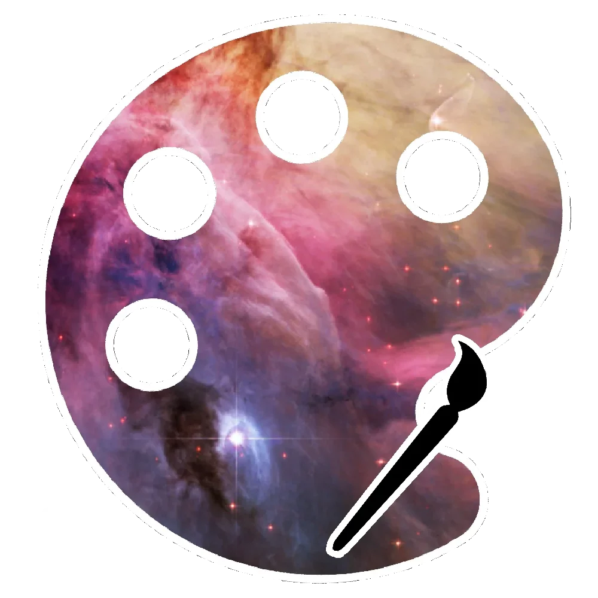
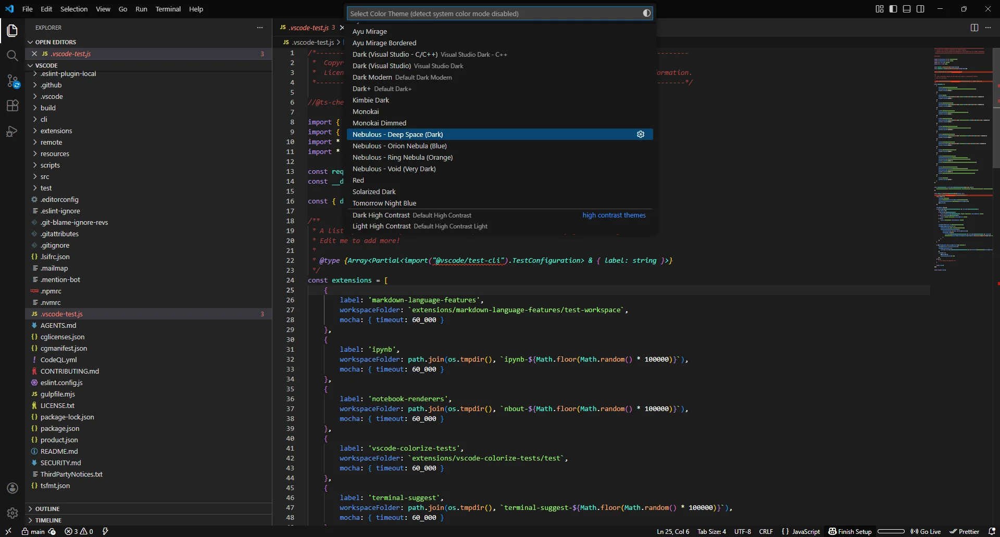
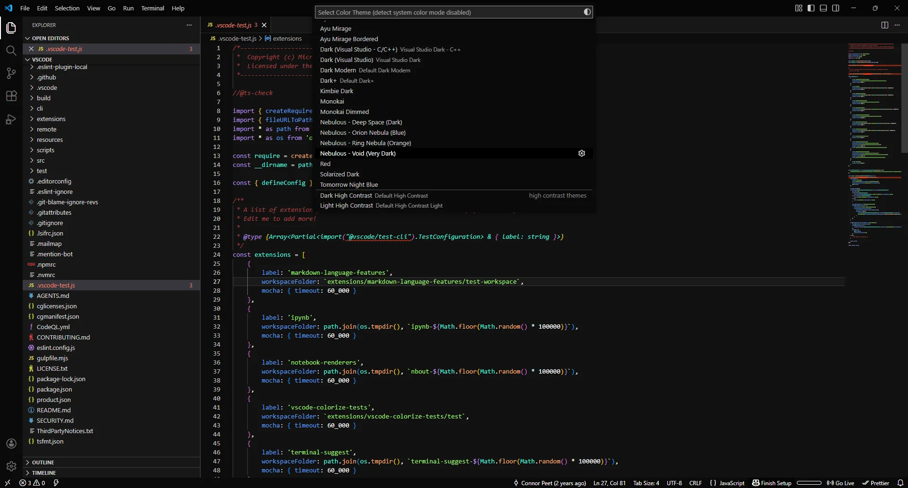
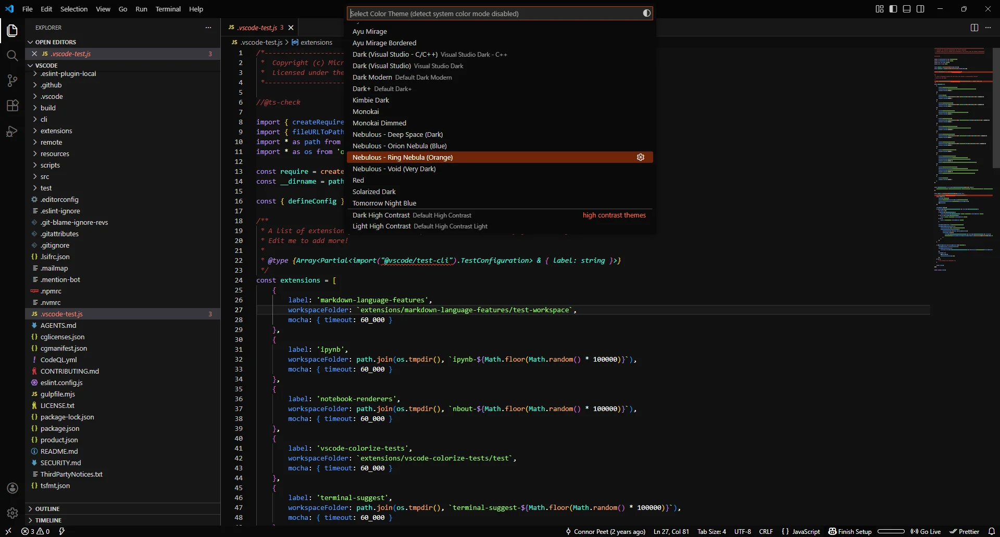
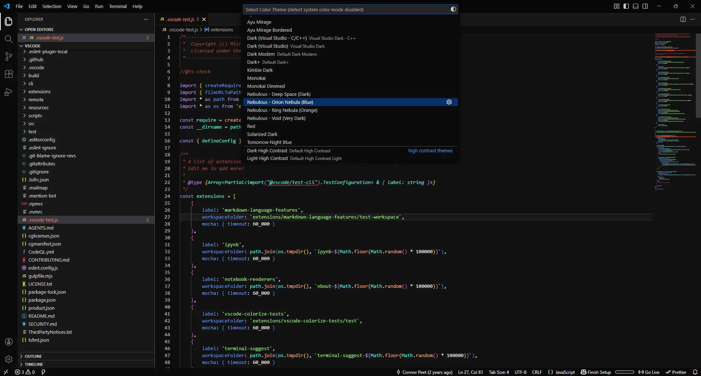
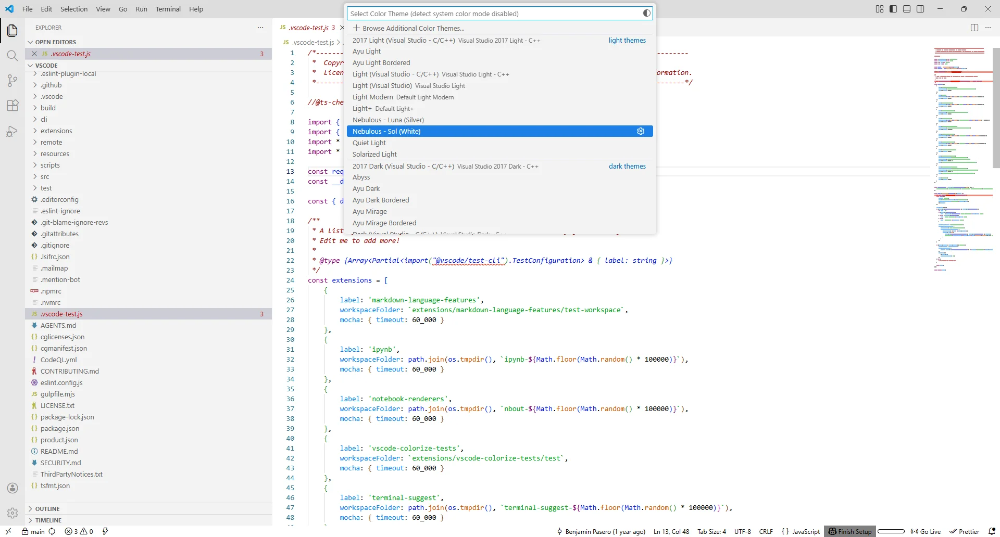
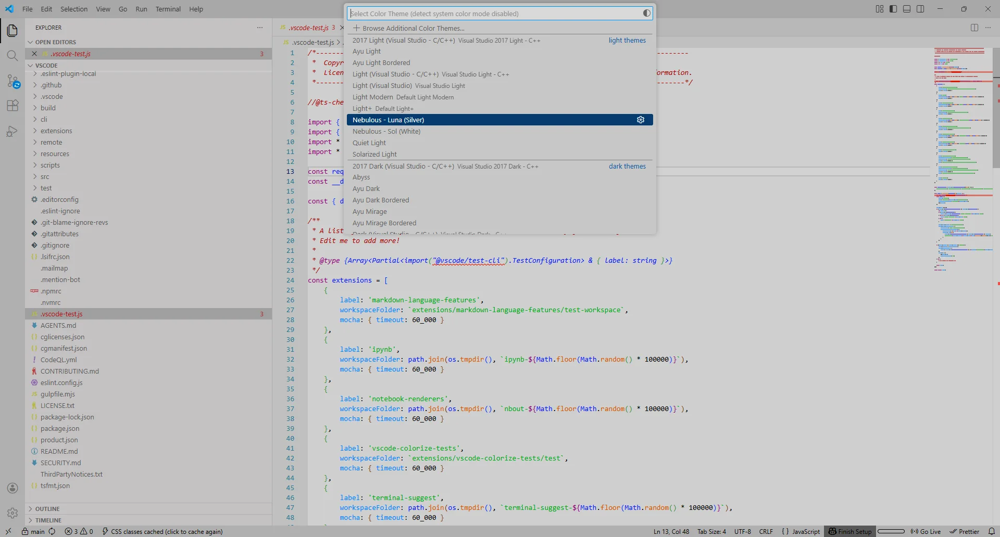

# Nebulous Color Themes

Inspired by the cosmos, this pack of color themes contains several different themes (both light and dark) to customize your VSCode window, code syntax, etc.

I created and use these personally because I found that I wanted different colors for various syntax to make my coding experience easier.

Can be found at the [Visual Studio Marketplace](https://marketplace.visualstudio.com/items?itemName=jtpeller.nebulous-color-themes).

## Contents

- [Nebulous Color Themes](#nebulous-color-themes)
  - [Contents](#contents)
  - [Color Themes](#color-themes)
    - [Dark Themes](#dark-themes)
      - ["Deep Space" (Dark)](#deep-space-dark)
      - ["Void" (Very Dark)](#void-very-dark)
      - ["Ring Nebula" (Orange)](#ring-nebula-orange)
      - ["Orion Nebula" (Blue)](#orion-nebula-blue)
    - [Light Themes](#light-themes)
      - ["Sol" (White)](#sol-white)
      - ["Luna" (Silver)](#luna-silver)

## Color Themes

These are the themes available in this VSCode Extension:

### Dark Themes

#### "Deep Space" (Dark)

The **Deep Space** theme is a "deep space" theme which is darker than the default VS Code dark theme, with modifications for additional contrast between key pieces of the code syntax.

#### "Void" (Very Dark)

The **Void** theme is an even darker version of the "Dark" theme. It changes the background and foreground colors to create a darker overall color scheme. All accent colors are greyscale (to a reasonable degree; certain functional color schemes like Git remain colored).

#### "Ring Nebula" (Orange)

The **Ring Nebula** theme is based upon the "Void" theme, except those greyscale accents are orange! This is reminiscent of the Ring Nebula.

#### "Orion Nebula" (Blue)

The **Orion Nebula** theme is based upon the "Void" theme, except those greyscale accents are blue! This is reminiscent of the Orion Nebula.

### Light Themes

#### "Sol" (White)

The **Sol** theme is a white theme inspired by the Sun. It utilizes a unique set of colors for the code syntax and the entire window.

#### "Luna" (Silver)

The **Luna** theme is a darker variant of the **Sol** theme, aiming to be more gray and muted, similar to the moon.

